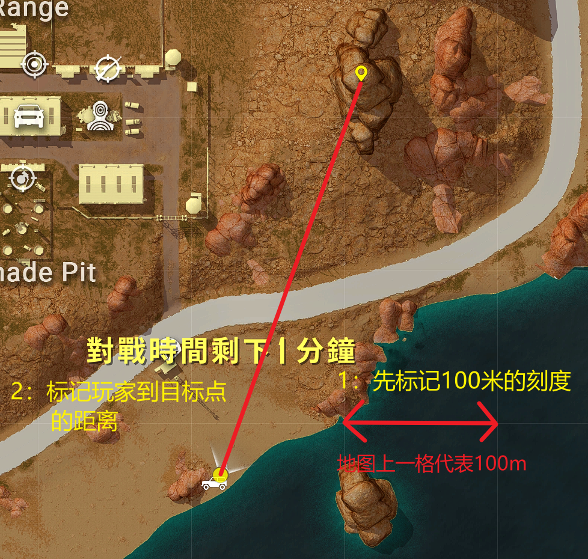
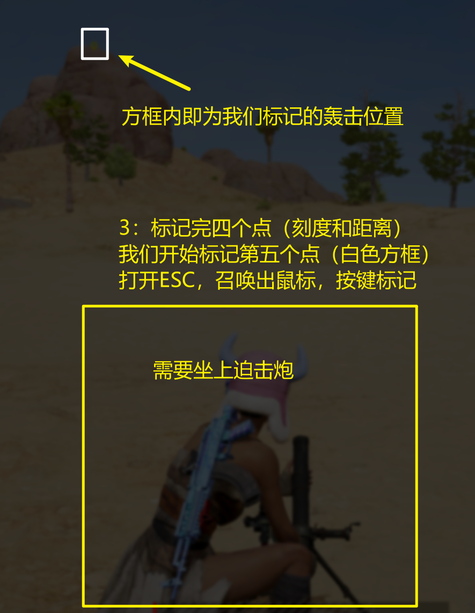

# Mortar Aid For PUBG

PUBG《极简》迫击炮辅助工具

English README: [README.en.md](README.en.md)

## 声明

仅用于技术交流和娱乐目的

## 基本原理

1. 标准网格100米比例尺缩放
2. 仰角高程修正

首先是斜抛运动方程和仰角的几何关系联立:

```math

y = - \frac{g}{2v_0^2 \cos^2{\theta}} x^2 + x\tan{\theta}

```

```math

\tan{\beta} = \frac{H}{L}

```

其中 $\theta$ 为迫击炮仰角， $v_0$ 为迫击炮初速度， $g$ 为重力加速度

我们需要的是 $R$ ，也就是本工具测量的值。


如果是低打高，包含仰角 $\beta$

在PUBG中，迫击炮最远距离`700m`的仰角是45°

(未精确测试，对比图如下)

121m射程仰角较大


700m射程仰角为45°，符合斜抛运动方程


所以当我们带入仰角 $\theta = 45°$

有

```math

R = \frac{v_0^2\sin{2\theta}}{g} = \frac{v_0^2}{g}

```

$R$ 这里表示理论最大射程（同一水平面下，迫击炮打到的直线距离）

到这里就足够了，严格来说不能带入地球的`g`

毕竟我也不知道PUBG的引擎里面是否有重力加速度，如果有，是否和地球一样呢？

不过考虑到最后的量纲，不需要考虑`g`的取值

目标位置是 $(L, H)$ 把 $R = \frac{v_0^2\sin{2\theta}}{g}$ 带入到斜抛运动方程

可以得到 $\theta$ 关于 $H$ 和 $L$ 的表达式

```math

\tan{\theta} = \frac{H}{L - \frac{L^2}{R}}

```

带回方程可以得到:

```math
R = \frac{\frac{HLv_0^2}{g} + L^3 ± \sqrt{(\frac{HLv_0^2}{g}  + L^3)^2 - (H^2 + L^2)(L^4 + \frac{2HLv_0^2}{g})}}{H^2 + L^2}
```

利用仰角 $\beta$ 的 $\tan{\beta} = \frac{H}{L}$

同时，记 $M = \frac{v_0^2}{g}$ （也就是迫击炮最远射程700m，不需要单独计算 $v_0$ 以防误差累积）

得到最终化简结果:


```math
R = \frac{L + tan{\beta}(M - \sqrt{M^2 - 2LM\tan{\beta} - L^2})}{\tan^2{\beta} + 1}
```

问题最终转为，已知水平距离 $L$ 和目标仰角 $\beta$ 求迫击炮应该设置的值 $R$

所以程序最终转为求 $L$ 和 $\beta$


* $L$ 用比例尺

* $R$ 用仰角表（数据详情参考[1]）

## 使用方法（默认：单文件 EXE）

```bash
python.exe -m PyInstaller --clean --noconfirm --onefile --windowed --uac-admin --name MortarAid --icon img\icon.ico --add-data "img;img" main.py
```
或者直接下载 [<u>release</u>](https://github.com/CurtisYan/MortarAid4PUBG/releases)

## 发布备选方案（稳定）

1. 先打包 onedir：

```bash
python.exe -m PyInstaller --clean --noconfirm MortarAid.spec
```

2. 再压缩发布包：

```powershell
Compress-Archive -Path .\dist\MortarAid\* -DestinationPath .\dist\MortarAid-win64.zip -Force
```

---

Alt + Q: 开始测距

Alt + Left: 开始标点

Alt + Right: 重置标点流程

R：计算完成后一键设置迫击炮距离刻度

设置入口：点击菜单栏“设置”，进入主程序内的设置页

可配置项：

- 语言（中文/英文）
- Alt + Q 触发窗口（0.3 / 0.5 / 0.8 秒）

说明：为避免误差和误触发，可在设置页调整 Alt + Q 触发窗口。

>若无法触发快捷键，请右键程序图标 -> 属性 -> 勾选“以管理员身份运行此程序”。


***（步骤1、2：开启地图并调整合适的缩放，执行步骤1、2时请勿缩放地图）***
**1：** 先标出地图上一百米网格的像素距离（一共要按两次，第一次是一百米网格的起始测量点，第二次为最终测量点），工具会计算比例尺。


**2：** 然后再标出自己的点和目标点。


***（步骤3：需要坐上迫击炮后标点）***
**3：** 最后标出目标点在屏幕上的位置（坐上迫击炮后按下TAB或ESC后可显示鼠标指针并将鼠标指针移动到标点Logo标记），工具会根据仰角表计算仰角。

最后工具输出迫击炮的射程。按 R 可一键设置迫击炮距离刻度

## 开发者流程说明

### 0) 代码结构

- `main.py`：应用组装层，负责页面切换、流程编排与事件连接。
- `mortar_tools/calculator.py`：测距、仰角和最终射程计算。
- `mortar_tools/hotkey_state.py`：Alt/Q 热键状态机（启动判定、退出防误触）。
- `mortar_tools/settings_store.py`：设置文件读写与路径解析。
- `mortar_tools/i18n_texts.py`：中英文文案集中管理。

以下逻辑位于 `main.py`，用于避免误触并保证测量流程可控。

### 1) 启动流程（Alt + Q）

- 记录 Alt 和 Q 的按下时刻。
- 只有两键按下时间差 <= `start_combo_max_interval`（可配置）才触发启动。
- 支持 Alt 先按或 Q 先按。

### 2) 流程中退出（Alt + Q）

- 进入测量后的前 1.5 秒是防误触窗口（从触发开始 Alt + Q 起计时）。
- 在这 1.5 秒内：
	- 仅触发 1 次 Alt + Q：窗口结束后退出流程。
	- 触发多次 Alt + Q：判定为误触，不退出流程。
- 超过这 1.5 秒后，流程中 Alt + Q 会直接退出，不再走 1.5 秒判定。

### 3) 流程中重置（Alt + 右键）

- 流程中按住 Alt 并右键，会设置 `reset_requested = True`。
- 当前步骤会中断并回到第一步（设置100米比例尺：第一个点）。

### 4) 流程中标点（Alt + 左键）

- 按住 Alt 并左键，记录鼠标屏幕坐标。
- 按步骤采集比例尺点、测距点和仰角点。

### 5) 结果窗口内快速调距（R）

- 最终距离计算完成后，结果窗口会显示 5 秒。
- 仅在这 5 秒窗口内按 `R`，会触发自动滚轮调距。
- 自动调距会先重置到 700，再滚动到计算结果对应刻度。

### 6) 设置页与设置持久化

- 主窗口是“首页/设置页”单窗口切换。
- 设置页可修改语言和触发窗口。
- Windows 下配置写入 `%APPDATA%/MortarAid/settings.json`。
- 若新路径不存在，会兜底读取旧版根目录 `settings.json`。
- `settings.json` 建议仅用于本机运行配置，不参与协作合并。

## 参考文献

> 参考文献：
> 
> [1] 绝地King-of-Mortar. 《PUBG迫击炮开炮密位公式推导》. 小黑盒, 2025-01-03. [link](https://api.xiaoheihe.cn/v3/bbs/app/api/web/share?link_id=b7a56f9c397c)
> 
> [2] 一只黄小娥. Bilibili, 2024-10-03 [link](https://www.bilibili.com/video/BV1Ub4VeyEFA/?vd_source=56c580e6d408a69243bf3cc1af31f92d)
>
> [3] 一只黄小娥. 迫击炮测距（手动版）版本历史, 2025/12/6 [link](https://www.yzhxe.cn/file-downloads/1/4)
